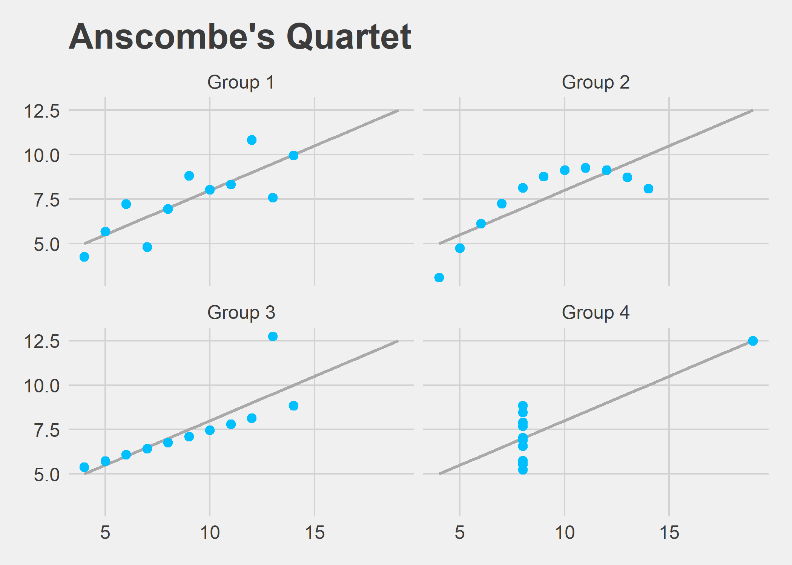

Anscombe's Quartet in Tidyverse.

|Group   | Mean X| Variance X| Mean Y| Variance Y| Correlation X and Y| Intercept| Slope| R Squared|
|:-------|------:|----------:|------:|----------:|-------------------:|---------:|-----:|---------:|
|Group 1 |      9|         11|    7.5|        4.1|                0.82|         3|   0.5|      0.67|
|Group 2 |      9|         11|    7.5|        4.1|                0.82|         3|   0.5|      0.67|
|Group 3 |      9|         11|    7.5|        4.1|                0.82|         3|   0.5|      0.67|
|Group 4 |      9|         11|    7.5|        4.1|                0.82|         3|   0.5|      0.67|

